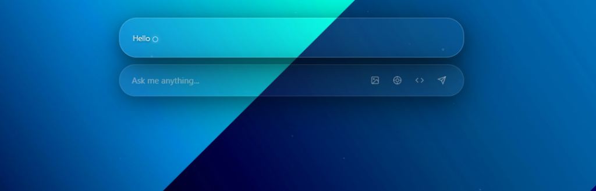

<div align="center">


# VISIONPRO — SPATIAL ASSISTANT
### The Next Dimension of Human-AI Interaction
**Vision Pro Aesthetic • Groq Powered • Real-time Performance**

[](https://opensource.org/licenses/MIT)
[](#)
<p align="center">
  
</p>

---

</div>

## 💎 The Spatial Experience
VisionPro Assistant isn't just an application—it's an intelligent membrane that lives above your operating system. Inspired by Apple Vision Pro's "Glassmorphism" aesthetic, it provides instant access to the world's fastest AI via Llama 3 models (Groq).

<p align="center">
  <a href="https://github.com/zakrievahmed129-lgtm/VisionPro-Assistant/releases/latest">
    
  </a>
</p>

### ✨ Key Features
- **Oracle Rendering Engine**: Fluid, organic typography with motion blur and GPU-accelerated batch rendering (Oracle Frame).
- **Autonomous Vision**: Analyze your screen in under 30ms using a RAM-only capture engine.
- **Search Protocols**: Native Tavily integration for real-time news synthesis without latency.
- **Plugin Modularity**: Open architecture allowing for OS expansion via simple JS scripts.

---

## ⚡ Layered Performance
VisionPro Assistant adapts to your hardware through two distinct rendering profiles:

| Mode | Target | Features |
| :--- | :--- | :--- |
| **Spatial Ultra** | GPU (RTX/Core) | Full Glassmorphism, 3D Tilt, dynamic particles (Solid 60 FPS). |
| **Eco Glass** | Standard CPU | Optimized for laptops, simplified animations, reduced power consumption. |

---

## 📦 Installation & Deployment

### Prerequisites
- [Node.js](https://nodejs.org/) (v18+)
- A [Groq](https://console.groq.com/) API Key
- A [Tavily](https://tavily.com/) API Key (Optional, for web search)

### Quick Start
```bash
# Clone the repository
git clone https://github.com/zakrievahmed129-lgtm/VisionPro-Assistant.git
cd VisionPro-Assistant

# Install dependencies
npm install

# Launch the experience
npm start
```

---

## 🛡️ Security & Transparency
- **Local Architecture**: Your API keys never leave your machine. They are stored in a secure local `config.json` file (Git-excluded).
- **Zero-Signature**: The portable executable is digitally unsigned to ensure the binary you download exactly matches the open-source code provided here.
- **Code Audit**: Users are encouraged to inspect the `/src` folder to verify no third-party data transmission.
- **VirusTotal**: [Binary Analysis Report](https://www.virustotal.com/gui/file/83530f1b50eca81ebe552cdc31196fee0663a2786b76e18e1e0363dbc4b74502?nocache=1) (67/68 Clean - 1 False Positive).

---

<div align="center">
  <sub>VisionPro Digital Assistant • 2026</sub>
</div>
